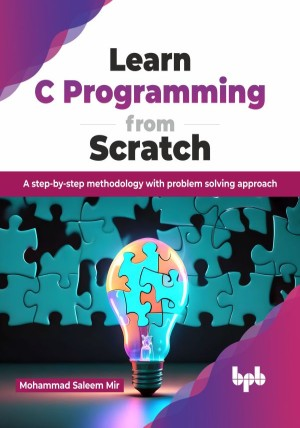

# Learn C Programming from Scratch

Unlock the power of C programming to embark on an epic journey of programming expertise with our comprehensive C programming book

This is the repository for [Learn C Programming from Scratch
](https://bpbonline.com/products/learn-c-programming-from-scratch?variant=43118820131016),published by BPB Publications.

## About the Book
C works as the building block for tons of computer programs and systems. “Learn C Programming from Scratch” is your ultimate handbook to harness the power of C. This guide gives you the information and skills you need to confidently dive into the world of programming.

This beginner-friendly book takes you on a step-by-step journey through the fundamentals of C, starting with basic syntax and control flow and gradually building your skills to tackle more complex concepts like functions, arrays, and pointers. Each chapter is packed with clear explanations, real-world examples, and practical exercises to solidify your understanding. You will learn not only what the code does but also why it works the way it does, empowering you to solve problems confidently and efficiently.

This book goes beyond syntax with a problem solving mindset crucial for programming success. Through this book, you will learn to tackle real-world challenges, translate them into efficient C code, and implement precise solutions.

## What You Will Learn
• Learn C programming from scratch by starting with the basics and progressing to more advanced topics.

• Explore real-world applications and projects with hands-on coding, from system programming to embedded systems and game development.

• Gain problem solving and algorithmic thinking by solving a wide range of programming challenges using C.

• Develop efficient and optimized code with improved performance and efficient memory management. 

• Acquire cross-platform and future-proof skills that are transferable to other programming languages and platforms.   
